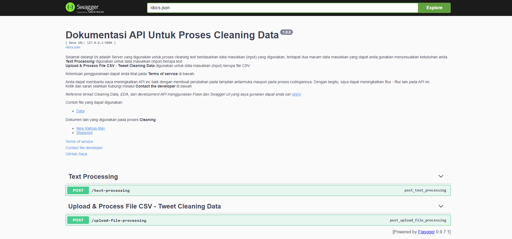

# Binar-Gold-Challenge
## Tentang API

Proses pembuatan API menggunakan flask dan Swagger UI untuk membantu membuat tampilan antar-muka dokumentasi (docs) lebih interaktif. Pada API ini terdapat 2 endpoint yaitu:
> 1. Text Processing digunakan untuk membersihkan text dengan masukkan (input) berupa string 
> 2. Upload & Process File CSV digunakan untuk membersihkan text dengan masukkan (input) berupa file CSV.

## Daftar Fungsi API
### Text Processing
Pada Text Processing proses cleaning data mencakup:
- Semua huruf akan diubah menjadi lowercase
- Menghapus kata url, http dan http 
- Menghapus semua kata yang mengandung ‘/’ seperti /n dan /th47g
- Menghapus text emoji seperti :D dan :)
- Menghapus semua karakter di luar huruf, angka dan whitespace
- Menghapus extra space

### Upload & Process File CSV
Pada Upload & Process File CSV  - Tweet Cleaning Data proses cleaning data mencakup:
- Semua huruf akan diubah menjadi lowercase
- Menghapus kata user, rt, url, https, http dan &amp
- Menghapus semua kata yang mengandung ‘/’ seperti /n dan /th47g
- Menghapus text emoji seperti :D dan :)
- Menghapus semua karakter di luar huruf dan whitespace
- Menghapus semua angka
- Menghapus extra space
- Mengubah setiap kata yang terdapat pada New Kamus Alay menjadi arti katanya
- Menghapus stopword yang terdapat pada List stopword

## Daftar File
Selain API, terdapat file lain yang digunakan untuk proses Cleaning dan Exploratory Data Analysis (EDA)
- EDA Tweet data part 1.ipynb
- EDA Tweet data part 2.ipynb

> 2 file di atas merupakan file yang berisi semua proses EDA menggunakan dataset yang didapat dari penelitian ini bersumber dari Workshop on Abusive Language Online (Ibrohim M,  2019) yang publikasinya dapat diakses [di sini](https://github.com/okkyibrohim/id-multi-label-hate-speech-and-abusive-language-detection).

### Dalam Folder API
- **app.py** adalah program untuk menjalan API
- **DataCleaning.py** merupakan file yang digunakan untuk proses cleaning di dalam program API
- **Data_For_DataCleaning** merupakan folder yang berisi file .csv dan .txt untuk keperluan program **DataCleaning.py**
- **DataBase** merupakan folder yang digunakan untuk menyimpan seluruh data pre dan pasca processing menggunakan API
- **docs** merupakan folder yang berisi template Swagger UI

    > **text_processing.yml** template endpoint **Text Processing**
    
    > **processing_file.yml** template endpoint **Upload & Process File CSV**